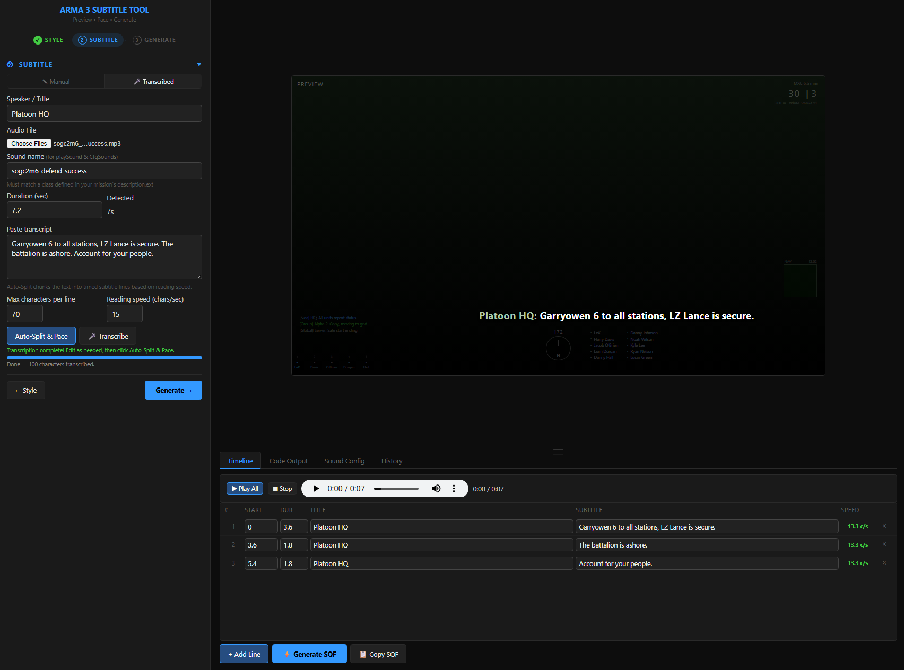

# Arma 3 Subtitle Tool

A self-contained browser-based tool for designing, previewing, and generating multiplayer-safe Arma 3 subtitle sequences.



> **Beta** — see [CHANGELOG](CHANGELOG.md) for what's included and known issues.

---

## What's in the box

| File | Purpose |
|------|---------|
| `subtitle-tool.html` | The tool — open directly in any modern browser |
| `functions/fn_createSubtitle.sqf` | Companion SQF function for your Arma 3 mission |

---

## Quick Start

1. Open `subtitle-tool.html` in Chrome, Edge, or Firefox
2. **Step 1 — Style:** Pick a preset (BLUFOR, COD, Halo, etc.) or configure your own colors and font
3. **Step 2 — Subtitle:** Choose **Manual** to type speaker and text directly, or **Transcribed** to load audio and auto-generate lines
4. Click **▶ Preview** to see it in the 16:9 frame
5. **Step 3 — Generate:** Click **Generate SQF** and copy the output into your mission

---

## Features

- **Wizard Sidebar** — guided three-step flow (Style → Subtitle → Generate)
- **Live 16:9 Preview** — Arma HUD overlays (compass, GPS, squad bar); scales with window size
- **Style Presets** — BLUFOR, OPFOR, INDFOR, Civilian, Unknown, COD Ally/Enemy, Wingman, Halo, Halo AI
- **Custom Presets** — Save your own color/size/font combos
- **Drag & Resize** — Position the subtitle anywhere on the preview frame
- **Timeline Editor** — Visual per-entry editor with speed (CPS) indicators; resizable panel
- **Manual Mode** — Type speaker and subtitle text directly with live preview
- **Transcribed Mode** — Load audio, paste or transcribe a script, auto-split into timed entries
- **AI Transcription** — In-browser Whisper transcription via Transformers.js (no server needed)
- **Batch Transcription** — Select multiple audio files; all transcribed sequentially
- **Generation History** — Last 15 generates / copies / transcriptions cached; click any entry to restore all settings instantly
- **Dual SQF Modes** — `remoteExec` function calls or self-contained inline `cutText` spawn blocks
- **playSound Integration** — Optionally include MP-compatible `playSound` alongside subtitles
- **CfgSounds Export** — Auto-generates the `description.ext` sound config from your audio file
- **Project Save/Load** — Persist your work in browser localStorage

---

## Mission Setup (Function Call mode)

### 1. Copy the SQF function

Place `functions/fn_createSubtitle.sqf` into your mission folder:

```
YourMission.Altis/
├── functions/
│   └── fn_createSubtitle.sqf
├── sounds/
│   └── yourAudio.ogg
└── description.ext
```

### 2. Register function in `description.ext` (replace `<TAG>`)

```cpp
class CfgFunctions {
    class <TAG> {
        class GUI {
            file = "functions";
            class subtitle {};
        };
    };
};
```

This registers the function as `<TAG>_fnc_subtitle`.

### 3. Sound setup (optional)

The tool's **CfgSounds** tab generates this config automatically — just paste it into your `description.ext`:

```cpp
class CfgSounds {
    class radio_transmission_01 {
        name = "radio_transmission_01";
        sound[] = {"sounds\\radio_transmission_01.ogg", 1, 1};
        titles[] = {};
    };
};
```

---

## SQF Output Modes

### Function Call (recommended for multiplayer)

```sqf
[] spawn {
    "radio_transmission_01" remoteExec ["playSound", 0];

    ["HQ", "All units, move to grid 045-128.", 5] remoteExec ["SB_fnc_subtitle", 0];
    sleep 5;
    ["HQ", "Enemy armor at the bridge. Weapons free.", 4] remoteExec ["SB_fnc_subtitle", 0];
    sleep 4;
};
```

### Inline Spawn (no external function needed)

Self-contained `cutText` block — paste anywhere, works without the SQF file:

```sqf
[] spawn {
    "SB_subtitle" cutText ["<t align='center' size='1.3' ...>HQ</t>...", "PLAIN DOWN", -1, true, true];
    sleep 5;
    "SB_subtitle" cutFadeOut 0.5;
};
```

---

## Function Parameters — `fn_createSubtitle.sqf`

```sqf
[_title, _subtitle, _length, _titleColor, _subtitleColor, _fadeOut, _titleSize, _subtitleSize, _font, _posX, _posY, _posW, _layout]
remoteExec ["SB_fnc_subtitle", 0];
```

| # | Parameter | Default | Description |
|---|-----------|---------|-------------|
| 1 | `_title` | — | Speaker name / title line |
| 2 | `_subtitle` | — | Subtitle text |
| 3 | `_length` | — | Duration in seconds |
| 4 | `_titleColor` | `"#3399FF"` | Title hex color |
| 5 | `_subtitleColor` | `"#FFFFFF"` | Subtitle hex color |
| 6 | `_fadeOut` | `true` | Fade out after duration |
| 7 | `_titleSize` | `2.2` | Title text size (relative) |
| 8 | `_subtitleSize` | `1.8` | Subtitle text size (relative) |
| 9 | `_font` | `"PuristaSemibold"` | Arma font class |
| 10 | `_posX` | `-1` | Horizontal position (0–1 safezone fraction); `-1` = classic cutText |
| 11 | `_posY` | `-1` | Vertical position (0–1 safezone fraction) |
| 12 | `_posW` | `0.8` | Width (0–1 safezone fraction) |
| 13 | `_layout` | `"stacked"` | `"stacked"` (title above) or `"inline"` (speaker: text) |

**Minimal call:**
```sqf
["HQ", "Move out.", 4] remoteExec ["SB_fnc_subtitle", 0];
```

**Full call:**
```sqf
["CORTANA", "Chief, we need to move.", 4, "#ADD8E6", "#ADD8E6", true, 1.0, 1.1, "RobotoCondensedLight", 0.1, 0.82, 0.8, "inline"]
remoteExec ["SB_fnc_subtitle", 0];
```

---

## Batch Transcription

1. In the **Subtitle & Audio** section, click the audio file input and select **multiple files** (Ctrl+click)
2. Click **Transcribe**
3. Each file is processed in sequence; the first file loads into the timeline
4. All results are saved to the **History** tab — click any entry to restore that file's transcript and timeline

> First-time use downloads the Whisper model (~75 MB). It's cached by the browser afterwards.

---

## Generation History

Every **Generate SQF**, **Quick Copy**, and **Transcription** saves a snapshot of all current settings (preset, colors, timeline, audio info) to the History tab. Up to 15 entries are stored.

- Click **Restore** on any card to reload that exact state
- Click **×** to delete a single entry
- Click **Clear All** to wipe the history

---

## Browser Compatibility

| Browser | Status |
|---------|--------|
| Chrome 112+ | ✅ Full support |
| Edge 112+ | ✅ Full support |
| Firefox 110+ | ✅ Full support |
| Safari 16.4+ | ✅ Full support |

Whisper transcription requires WebAssembly (WASM) support — all modern browsers qualify.

---

## Reporting Issues

This is a **beta release**. Please report bugs, unexpected SQF output, or layout issues by opening a GitHub issue and including:
- Browser and version
- Preset used
- Steps to reproduce
- What the generated SQF looked like vs. what was expected

---

## License

[MIT](LICENSE) — free to use, modify, and distribute.

---

## Attribution

If you use this tool to build your own version or release a fork publicly, a credit in your code, readme, or release notes is appreciated:

> Based on [Arma 3 Subtitle Tool](https://github.com/[your-repo]/arma3-subtitle-tool) by SerBlackwater

Not required by the license — just appreciated!
